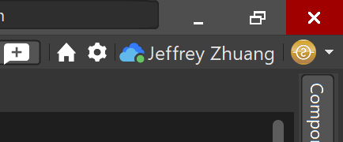
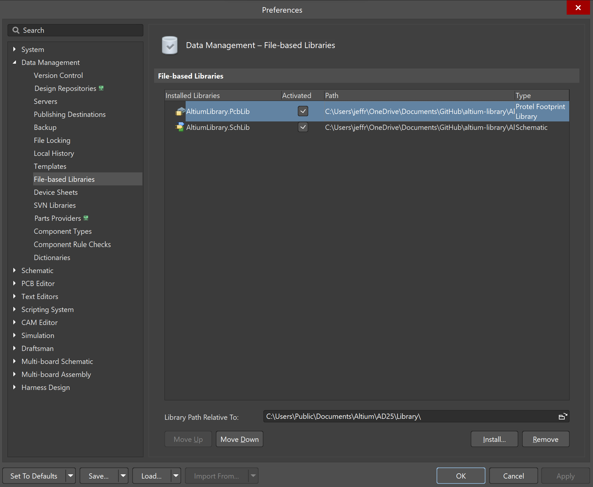
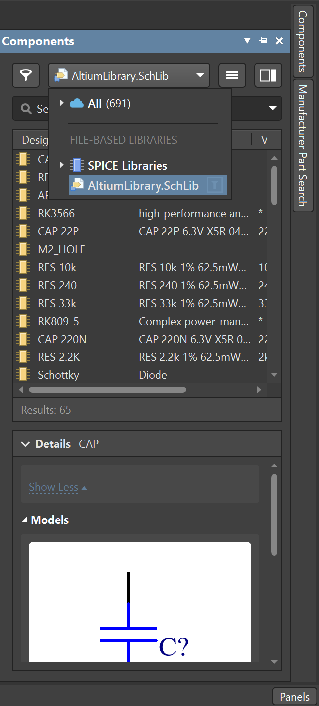

# Altium Library

## Importing the library

1. Press the gear icon on the top right corner

2. Navigate to `Data Management > File-based libraries`, press the install button on the bottom right corner, 
and select the `.PcbLib` and `.SchLib` files

## Using components from the library

1. Open the `Components` panel and select `AltiumLibrary.SchLib` in the dropdown menu

